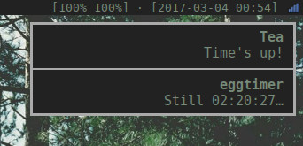

# *et*, egg timer

## What?
A simple (egg) timer for a GNU/Linux-operating system based
on [libnotify](https://developer.gnome.org/libnotify/).

## Screenshot?

The [Dunst-notification server](http://www.knopwob.org/dunst/) running on
[dwm](http://dwm.suckless.org/).

## How?
To start an **et** just fire a command.
```bash
$ et 90 # Reminds you in 90 seconds
$ et 1:30 # Also reminds you in 90 seconds
$ et 1:30:00 # Reminds you in 90 minutes
$ et 10:00 Pizza # Reminds you in 10 minutes and says Pizza
```

To get the current status, send a `SIGUSR1`-signal to the process.
Don't worry, it won't stop.
```bash
$ et 30
Egg timer started!
Name: eggtimer, PID: 4242
Only 30 seconds remaining
$ kill -SIGUSR1 4242
```

You can also get the status of all **et**-instances by running
the `et-status.sh`-script.

Perhaps you want to set up some keybindings in your WM for a
flawless experience.

## Build?
Just execute `make` and you've got a binary. If you're on
[NixOS](https://nixos.org/), check out `make nix`.

## License?
GNU General Public License in the third version.
